# Rune Plugin — State Machine Reference

> *"State machines are underrated for debugging because they force you to explicitly name
> every possible condition your code can be in. Most bugs happen in the unnamed states
> between the ones you thought about when writing the logic."*

This document maps every major Rune workflow as an explicit state machine — phases,
transitions, conditional gates, error paths, and artifacts. Use it to:

- **Verify correctness**: spot dead-end states, unreachable phases, orphaned artifacts
- **Debug failures**: trace exactly where a pipeline stopped and why
- **Understand recovery**: know which phases support resume/checkpoint
- **Onboard**: see the full picture before diving into SKILL.md prose

---

## Table of Contents

1. [Common Patterns](#common-patterns)
2. [Arc Pipeline](#1-arc-pipeline) (26 phases)
3. [Devise Pipeline](#2-devise-pipeline) (6 phases + sub-phases)
4. [Roundtable Circle](#3-roundtable-circle) (7 phases, shared orchestration)
5. [Appraise](#4-appraise) (code review)
6. [Audit](#5-audit) (full codebase)
7. [Strive](#6-strive) (swarm execution)
8. [Mend](#7-mend) (finding resolution)
9. [Forge](#8-forge) (plan enrichment)
10. [Goldmask](#9-goldmask) (impact analysis)
11. [Inspect](#10-inspect) (plan-vs-implementation)
12. [Cross-Workflow Dependencies](#cross-workflow-dependencies)
13. [Error Handling Tiers](#error-handling-tiers)

---

## Common Patterns

Every Rune workflow shares these foundational state machine patterns:

### Team Lifecycle (ATE-1)

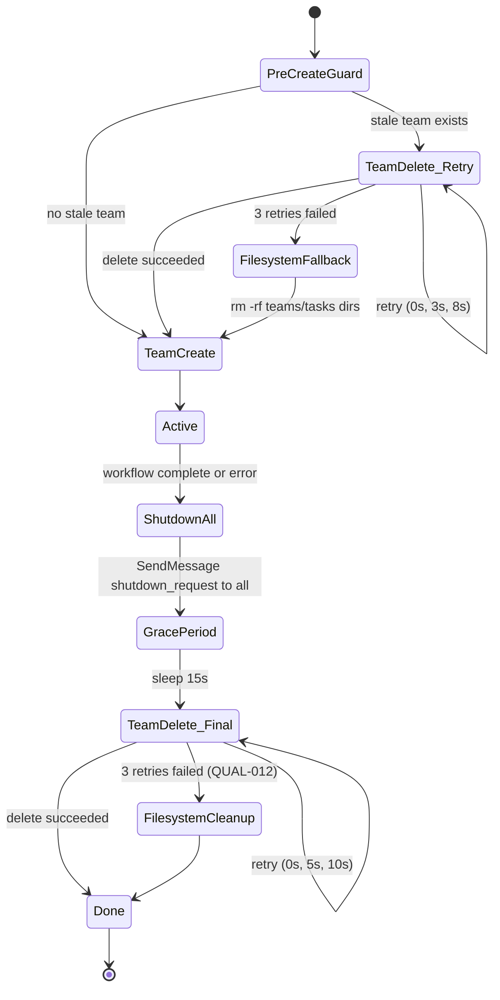

### Monitoring Loop (POLL-001)

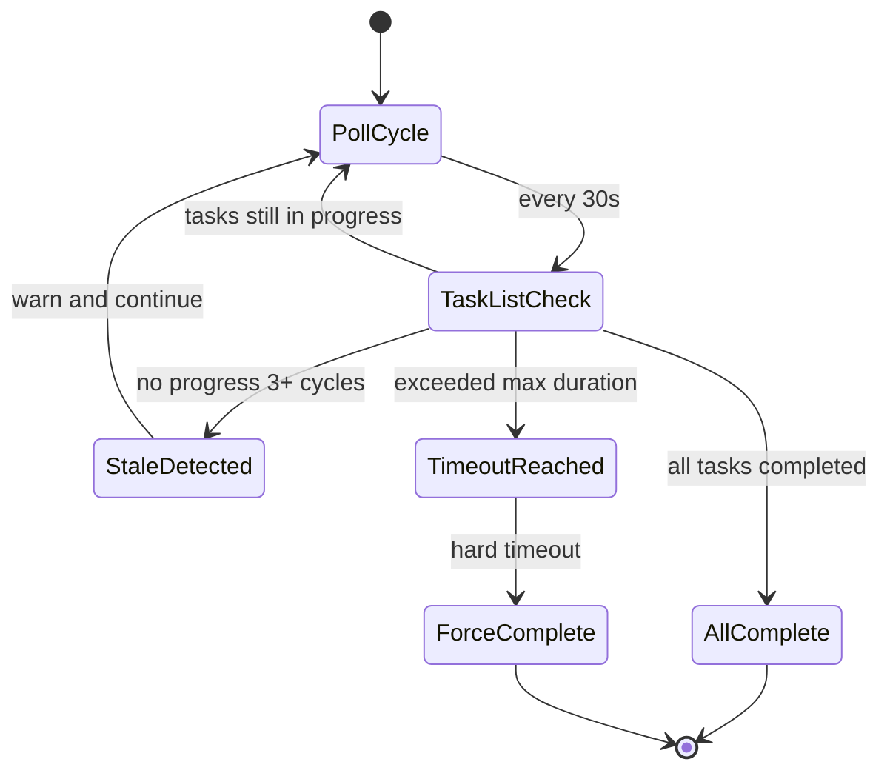

### State File (Session Isolation)

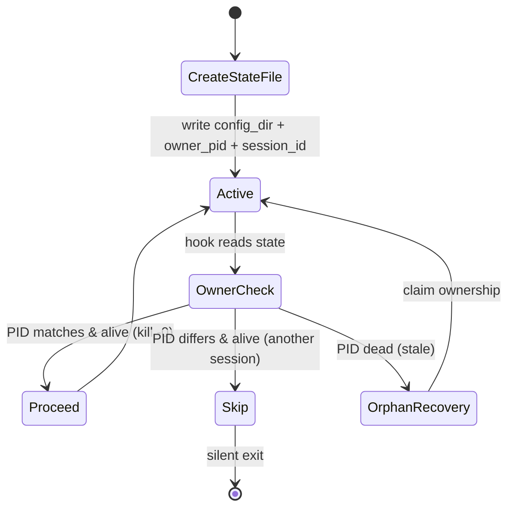

---

## 1. Arc Pipeline

**Command**: `/rune:arc plans/...`
**Duration**: 30–90 min | **Phases**: 26+ | **Resume**: Full checkpoint support

The arc pipeline is Rune's most complex state machine — a linear pipeline with
conditional branches, embedded sub-workflows (strive, appraise, mend, goldmask),
and 3-layer checkpoint/resume support.

```mermaid
stateDiagram-v2
    [*] --> Preflight

    state "Pre-flight" as Preflight {
        [*] --> GitStateCheck
        GitStateCheck --> FreshnessValidation
        FreshnessValidation --> StaleTeamCleanup
        StaleTeamCleanup --> [*]
    }

    Preflight --> Phase1_Forge : plan file valid

    state "Phase 1: Forge" as Phase1_Forge
    Phase1_Forge --> Phase2_PlanReview : enriched plan

    state "Phase 2: Plan Review" as Phase2_PlanReview {
        [*] --> ScrollReview
        ScrollReview --> VerificationGate
        VerificationGate --> [*] : PASS / CONCERN
        VerificationGate --> BLOCK : BLOCK verdict
    }

    Phase2_PlanReview --> Phase3_PlanRefinement : review findings
    Phase3_PlanRefinement --> Phase4_Verification : refined plan

    state "Phase 4: Verification" as Phase4_Verification
    Phase4_Verification --> Phase4_5_TaskDecomp : verified

    state "Phase 4.5: Task Decomposition" as Phase4_5_TaskDecomp
    Phase4_5_TaskDecomp --> Phase5_SemanticVerify : tasks extracted

    state "Phase 5: Semantic Verification" as Phase5_SemanticVerify
    Phase5_SemanticVerify --> DesignGate : requirements conform

    state "Design Gate" as DesignGate {
        [*] --> HasFigmaURL
        HasFigmaURL --> Phase5_2_DesignExtract : yes
        HasFigmaURL --> Phase5_Work : no
    }

    state "Phase 5.2: Design Extraction" as Phase5_2_DesignExtract
    Phase5_2_DesignExtract --> Phase5_2b_DesignVerify : VSM generated

    state "Phase 5.2b: Design Verification" as Phase5_2b_DesignVerify
    Phase5_2b_DesignVerify --> Phase5_3_DesignIteration : fidelity scored

    state "Phase 5.3: Design Iteration" as Phase5_3_DesignIteration
    Phase5_3_DesignIteration --> Phase5_Work : converged

    state "Phase 5: Work (Strive)" as Phase5_Work
    Phase5_Work --> Phase6_GapAnalysis : feature branch + commits

    state "Phase 6: Gap Analysis" as Phase6_GapAnalysis
    Phase6_GapAnalysis --> Phase6_5_CodexGap : gaps identified

    state "Phase 6.5: Codex Gap Analysis" as Phase6_5_CodexGap
    Phase6_5_CodexGap --> Phase6_7_GapRemediation : cross-verified

    state "Phase 6.7: Gap Remediation" as Phase6_7_GapRemediation
    Phase6_7_GapRemediation --> Phase7_Goldmask : gaps fixed (mend)

    state "Phase 7: Goldmask Verification" as Phase7_Goldmask
    Phase7_Goldmask --> Phase7_5_CodeReview : risk assessed

    state "Phase 7.5: Code Review (Appraise)" as Phase7_5_CodeReview
    Phase7_5_CodeReview --> Phase7_6_GoldmaskCorr : TOME.md

    state "Phase 7.6: Goldmask Correlation" as Phase7_6_GoldmaskCorr
    Phase7_6_GoldmaskCorr --> Phase7_7_Test : risk map updated

    state "Phase 7.7: Test" as Phase7_7_Test
    Phase7_7_Test --> Phase7_8_TestCoverage : test results

    state "Phase 7.8: Test Coverage Critique" as Phase7_8_TestCoverage
    Phase7_8_TestCoverage --> Phase8_Mend : coverage analyzed

    state "Phase 8: Mend" as Phase8_Mend
    Phase8_Mend --> Phase8_5_VerifyMend : findings resolved

    state "Phase 8.5: Verify Mend" as Phase8_5_VerifyMend
    Phase8_5_VerifyMend --> DesignGate2 : verified

    state "Post-Mend Design Gate" as DesignGate2 {
        [*] --> HasDesign2
        HasDesign2 --> Phase8_7_DesignIter : yes
        HasDesign2 --> Phase9_PreShip : no
    }

    state "Phase 8.7: Design Iteration" as Phase8_7_DesignIter
    Phase8_7_DesignIter --> Phase9_PreShip : fidelity converged

    state "Phase 9: Pre-Ship Validation" as Phase9_PreShip
    Phase9_PreShip --> Phase9_1_ReleaseQC : final checks pass

    state "Phase 9.1: Release Quality Check" as Phase9_1_ReleaseQC
    Phase9_1_ReleaseQC --> Phase9_2_Ship : release ready

    state "Phase 9.2: Ship" as Phase9_2_Ship
    Phase9_2_Ship --> BotGate : push + PR created

    state "Bot Gate" as BotGate {
        [*] --> HasBotReview
        HasBotReview --> Phase9_3_BotWait : yes (talisman configured)
        HasBotReview --> Phase9_5_Merge : no
    }

    state "Phase 9.3: Bot Review Wait" as Phase9_3_BotWait
    Phase9_3_BotWait --> Phase9_4_PRComments : bot reviews in

    state "Phase 9.4: PR Comment Resolution" as Phase9_4_PRComments
    Phase9_4_PRComments --> Phase9_5_Merge : comments resolved

    state "Phase 9.5: Merge" as Phase9_5_Merge
    Phase9_5_Merge --> [*] : merged to main

    BLOCK --> [*] : pipeline halted
```

### Arc Checkpoint Layers

| Layer | Stored In | Contains | Resume Behavior |
|-------|-----------|----------|-----------------|
| Arc checkpoint | `tmp/arc/{id}/checkpoint.json` | Current phase, timing, todo IDs | `--resume` restores exact phase |
| Phase timing | `tmp/arc/{id}/phase-timing.json` | Per-phase start/end timestamps | Diagnostic only |
| Todo files | `tmp/arc/{id}/*.todo.md` | Per-task status history | Workers resume unclaimed tasks |

---

## 2. Devise Pipeline

**Command**: `/rune:devise "feature description"`
**Duration**: 5–15 min | **Phases**: 6 + sub-phases | **Resume**: None (ephemeral)

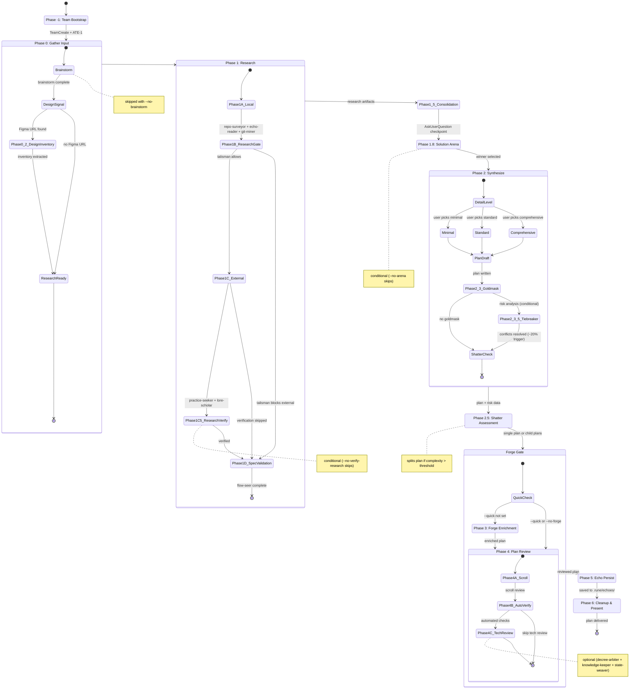

### Devise Artifacts

| Phase | Artifact | Path |
|-------|----------|------|
| 0 | Brainstorm output | `tmp/plans/{ts}/brainstorm.md` |
| 1 | Research outputs | `tmp/plans/{ts}/*-research.md` |
| 2 | Plan file | `plans/YYYY-MM-DD-{type}-{name}-plan.md` |
| 2.5 | Child plans (if shattered) | `plans/YYYY-MM-DD-{type}-{name}-part-N-plan.md` |
| 3 | Forge enrichments | `tmp/plans/{ts}/*-enrichment.md` |
| 4 | Review outputs | `tmp/plans/{ts}/*-review.md` |

---

## 3. Roundtable Circle

**Shared orchestration** used by: Appraise, Audit, Codex-Review
**Phases**: 7 (0–7) | Generic lifecycle for multi-agent review

```mermaid
stateDiagram-v2
    [*] --> Phase0_Preflight

    state "Phase 0: Pre-flight" as Phase0_Preflight {
        [*] --> GitStatus
        GitStatus --> FileDiscovery
        FileDiscovery --> ScopeSelection
        ScopeSelection --> Phase0_3_ContextIntel : scope determined
        Phase0_3_ContextIntel --> Phase0_4_LinterDetect : PR metadata (optional)
        Phase0_4_LinterDetect --> Phase0_5_LoreLayer : linter config (optional)
        Phase0_5_LoreLayer --> [*] : risk intelligence (optional)
    }

    Phase0_Preflight --> Phase1_RuneGaze

    state "Phase 1: Rune Gaze" as Phase1_RuneGaze
    note right of Phase1_RuneGaze
        File-to-Ash classification
        Maps each file to its specialist reviewer
    end note
    Phase1_RuneGaze --> Phase2_ForgeTeam : classification matrix

    state "Phase 2: Forge Team" as Phase2_ForgeTeam
    note right of Phase2_ForgeTeam
        TeamCreate + inscription.json + signal dir
    end note
    Phase2_ForgeTeam --> Phase3_SummonAsh : team ready

    state "Phase 3: Summon Ash" as Phase3_SummonAsh {
        [*] --> SpawnMode
        SpawnMode --> Standard : file count <= chunk threshold
        SpawnMode --> Sharded : file count > threshold (v1.98.0+)
        SpawnMode --> Chunked : standard depth, large diff
        Standard --> ParallelSpawn : up to 7 Ashes
        Sharded --> ShardDistribution : split files across shards
        Chunked --> ChunkDistribution : split files into chunks
        ParallelSpawn --> [*]
        ShardDistribution --> ParallelSpawn
        ChunkDistribution --> ParallelSpawn
    }

    Phase3_SummonAsh --> Phase4_Monitor

    state "Phase 4: Monitor" as Phase4_Monitor {
        [*] --> PollLoop
        PollLoop --> PollLoop : TaskList every 30s
        PollLoop --> AllAshDone : all tasks completed
        PollLoop --> StaleAsh : 3+ cycles no progress
        PollLoop --> Timeout : max duration exceeded
        StaleAsh --> PollLoop : warn, continue
        Timeout --> ForceComplete
        AllAshDone --> Phase4_5_DoubtSeer : conditional
        AllAshDone --> [*] : skip doubt-seer
        Phase4_5_DoubtSeer --> [*] : claims cross-examined
        ForceComplete --> [*]
    }

    Phase4_Monitor --> Phase5_Aggregate

    state "Phase 5: Aggregate" as Phase5_Aggregate {
        [*] --> Phase5_0_PreAggregate
        Phase5_0_PreAggregate --> RunebinderSynth : threshold met
        RunebinderSynth --> Phase5_2_CitationVerify : TOME.md written
        Phase5_2_CitationVerify --> Phase5_4_TodoGen : citations validated
        Phase5_4_TodoGen --> [*] : todos created from TOME
    }

    Phase5_Aggregate --> Phase6_Verify

    state "Phase 6: Verify" as Phase6_Verify {
        [*] --> TruthsightValidation
        TruthsightValidation --> Phase6_2_CodexDiff : validated
        Phase6_2_CodexDiff --> Phase6_3_CodexArch : diff verified (optional)
        Phase6_3_CodexArch --> [*] : architecture reviewed (audit only)
        Phase6_2_CodexDiff --> [*] : skip codex
        TruthsightValidation --> [*] : skip codex
    }

    Phase6_Verify --> Phase7_Cleanup

    state "Phase 7: Cleanup" as Phase7_Cleanup {
        [*] --> ShutdownAllAsh
        ShutdownAllAsh --> GracePeriod
        GracePeriod --> TeamDeleteRetry
        TeamDeleteRetry --> EchoPersist : team deleted
        EchoPersist --> [*] : echoes saved
    }

    Phase7_Cleanup --> [*] : TOME.md delivered
```

### Built-in Ashes (Review Agents)

| Ash | Perspectives | Activation |
|-----|-------------|------------|
| Forge Warden | flaw-hunter, ember-oracle, void-analyzer, wraith-finder, rune-architect, forge-keeper + 3 inline | Always |
| Ward Sentinel | ward-sentinel | Always |
| Pattern Weaver | pattern-seer, mimic-detector, type-warden, depth-seer, blight-seer, trial-oracle, tide-watcher + 1 inline | Always |
| Veil Piercer | adversarial truth-telling | Always |
| Glyph Scribe | frontend review | Conditional (frontend files in diff) |
| Knowledge Keeper | documentation review | Conditional (doc changes >= 10 lines) |
| Codex Oracle | cross-model verification | Conditional (talisman enabled) |

---

## 4. Appraise

**Command**: `/rune:appraise` | **Extends**: Roundtable Circle
**Scope**: `diff` (changed files only)

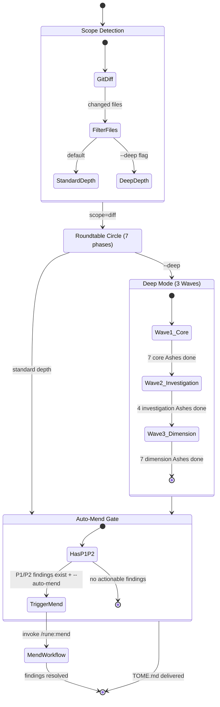

### Appraise Flags → State Transitions

| Flag | Effect on State Machine |
|------|------------------------|
| `--deep` | Enables 3-wave execution (Wave 1→2→3) |
| `--partial` | Skips cleanup, allows resume |
| `--dry-run` | Exits after scope detection |
| `--auto-mend` | Chains to Mend workflow on P1/P2 |
| `--no-chunk` | Disables chunked review |
| `--no-lore` | Skips Phase 0.5 risk intelligence |
| `--no-converge` | Disables doubt-seer Phase 4.5 |

---

## 5. Audit

**Command**: `/rune:audit` | **Extends**: Roundtable Circle
**Scope**: `full` (all files) | **Default depth**: `deep`

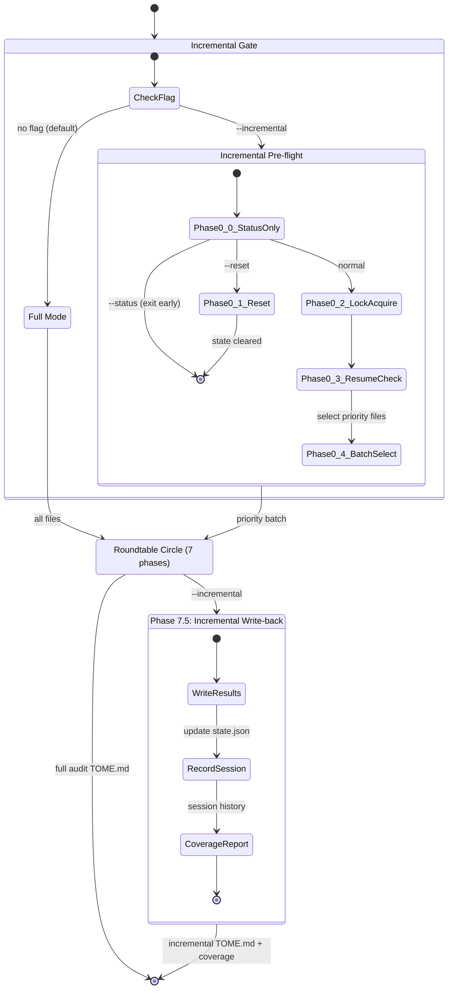

### Incremental Audit Priority Scoring

Files are scored by 6 factors for batch selection:

| Factor | Weight | Source |
|--------|--------|--------|
| Recency (last modified) | High | `git log` |
| Coverage (last audited) | High | `state.json` |
| Risk (churn + complexity) | Medium | Goldmask risk-map |
| Complexity (LOC + nesting) | Medium | Static analysis |
| Churn (change frequency) | Low | `git log --follow` |
| Owner (author distribution) | Low | `git blame` |

---

## 6. Strive

**Command**: `/rune:strive plans/...`
**Duration**: 10–30 min | **Workers**: rune-smith + trial-forger

```mermaid
stateDiagram-v2
    [*] --> Phase0_ParsePlan

    state "Phase 0: Parse Plan" as Phase0_ParsePlan {
        [*] --> ExtractTasks
        ExtractTasks --> DependencyAnalysis
        DependencyAnalysis --> [*]
    }

    Phase0_ParsePlan --> Phase0_5_EnvSetup

    state "Phase 0.5: Environment Setup" as Phase0_5_EnvSetup {
        [*] --> BranchCheck
        BranchCheck --> StashDirty : dirty working tree
        BranchCheck --> Ready : clean tree
        StashDirty --> Ready
        Ready --> [*]
    }

    Phase0_5_EnvSetup --> Phase0_7_Lock

    state "Phase 0.7: Workflow Lock" as Phase0_7_Lock
    Phase0_7_Lock --> Phase1_ForgeTeam : lock acquired (writer)

    state "Phase 1: Forge Team" as Phase1_ForgeTeam {
        [*] --> CreateSignalDir
        CreateSignalDir --> FileOwnership
        FileOwnership --> DesignContextGate
        DesignContextGate --> InjectDesignContext : Figma VSM exists
        DesignContextGate --> TaskCreation : no design context
        InjectDesignContext --> TaskCreation
        TaskCreation --> [*] : per-task todos + inscription
    }

    Phase1_ForgeTeam --> Phase2_SummonSwarm

    state "Phase 2: Summon Swarm" as Phase2_SummonSwarm {
        [*] --> WorktreeGate
        WorktreeGate --> WorktreeMode : --worktree or talisman
        WorktreeGate --> DirectMode : default
        DirectMode --> SpawnWorkers : rune-smith + trial-forger
        WorktreeMode --> WaveExecution : bounded batches
        WaveExecution --> SpawnWorkers
        SpawnWorkers --> [*]
    }

    Phase2_SummonSwarm --> Phase3_Monitor

    state "Phase 3: Monitor" as Phase3_Monitor {
        [*] --> PollLoop
        PollLoop --> PollLoop : TaskList every 30s
        PollLoop --> WorkersDone : all tasks completed
        PollLoop --> StuckWorker : no progress 3+ cycles
        StuckWorker --> PollLoop : warn
        WorkersDone --> Phase3_5_CommitBroker : direct mode
        WorkersDone --> Phase3_5_MergeBroker : worktree mode
        Phase3_5_CommitBroker --> Phase3_7_CodexCritique : committed
        Phase3_5_MergeBroker --> Phase3_7_CodexCritique : merged
        Phase3_7_CodexCritique --> [*] : optional cross-model check
    }

    Phase3_Monitor --> Phase4_QualityGates

    state "Phase 4: Quality Gates" as Phase4_QualityGates {
        [*] --> Phase4_1_TodoSummary
        Phase4_1_TodoSummary --> Phase4_3_DocConsistency
        Phase4_3_DocConsistency --> Phase4_4_QuickGoldmask
        Phase4_4_QuickGoldmask --> Phase4_5_CodexAdvisory
        Phase4_5_CodexAdvisory --> [*]
    }

    Phase4_QualityGates --> Phase5_EchoPersist
    Phase5_EchoPersist --> Phase6_Cleanup

    state "Phase 6: Cleanup" as Phase6_Cleanup {
        [*] --> ShutdownTeam
        ShutdownTeam --> TeamDelete
        TeamDelete --> ShipGate
        ShipGate --> Phase6_5_Ship : --approve or prompt
        ShipGate --> [*] : skip ship
    }

    state "Phase 6.5: Ship" as Phase6_5_Ship
    Phase6_5_Ship --> [*] : push + PR

    Phase6_Cleanup --> [*]
```

### Worker Types

| Worker | Role | Tools | Spawned |
|--------|------|-------|---------|
| rune-smith | Implementation | All (Read, Write, Edit, Bash, ...) | 1 per task wave |
| trial-forger | Test writing | All (Read, Write, Edit, Bash, ...) | 1 per test task wave |

---

## 7. Mend

**Command**: `/rune:mend tmp/.../TOME.md`
**Duration**: 3–10 min | **Workers**: mend-fixer (max 5 concurrent)

```mermaid
stateDiagram-v2
    [*] --> Phase0_Parse

    state "Phase 0: PARSE" as Phase0_Parse {
        [*] --> ExtractFindings
        ExtractFindings --> Deduplicate
        Deduplicate --> FilterQN : remove Q/N (questions & nits)
        FilterQN --> GroupByFile
        GroupByFile --> HandleTags : UNVERIFIED/SUSPECT
        HandleTags --> [*]
    }

    Phase0_Parse --> Phase0_5_Goldmask

    state "Phase 0.5: Goldmask Discovery" as Phase0_5_Goldmask
    note right of Phase0_5_Goldmask : optional risk-map + wisdom data
    Phase0_5_Goldmask --> Phase1_Plan

    state "Phase 1: PLAN" as Phase1_Plan {
        [*] --> DependencyAnalysis
        DependencyAnalysis --> FixerCount
        FixerCount --> WaveComputation
        WaveComputation --> RiskOverlay : Goldmask severity ordering
        RiskOverlay --> [*]
    }

    Phase1_Plan --> Phase1_5_Lock

    state "Phase 1.5: Workflow Lock" as Phase1_5_Lock
    Phase1_5_Lock --> Phase2_ForgeTeam : lock acquired (writer)

    state "Phase 2: FORGE TEAM" as Phase2_ForgeTeam
    note right of Phase2_ForgeTeam : inscription + finding sanitization
    Phase2_ForgeTeam --> Phase3_SummonFixers

    state "Phase 3: SUMMON FIXERS" as Phase3_SummonFixers {
        [*] --> WaveN
        WaveN --> SpawnBatch : max 5 concurrent
        SpawnBatch --> WaveMonitor
        WaveMonitor --> WaveN : more waves remain
        WaveMonitor --> [*] : all waves done
    }

    Phase3_SummonFixers --> Phase4_Monitor

    state "Phase 4: MONITOR" as Phase4_Monitor
    Phase4_Monitor --> Phase5_WardCheck

    state "Phase 5: WARD CHECK" as Phase5_WardCheck {
        [*] --> SecurityScan
        SecurityScan --> Phase5_5_CrossFile : SKIPPED findings
        Phase5_5_CrossFile --> Phase5_6_SecondWard : cross-file fixes applied
        Phase5_6_SecondWard --> Phase5_7_DocConsistency
        SecurityScan --> Phase5_7_DocConsistency : no cross-file needed
        Phase5_7_DocConsistency --> Phase5_8_CodexVerify : optional
        Phase5_8_CodexVerify --> Phase5_9_TodoUpdate
        Phase5_7_DocConsistency --> Phase5_9_TodoUpdate : skip codex
        Phase5_9_TodoUpdate --> Phase5_95_GoldmaskCheck
        Phase5_95_GoldmaskCheck --> [*] : MUST-CHANGE verified
    }

    Phase5_WardCheck --> Phase6_Report

    state "Phase 6: RESOLUTION REPORT" as Phase6_Report
    note right of Phase6_Report : convergence logic + Goldmask section
    Phase6_Report --> Phase7_Cleanup

    state "Phase 7: CLEANUP" as Phase7_Cleanup
    Phase7_Cleanup --> [*] : resolution-report.md delivered
```

### Resolution Statuses

| Status | Meaning |
|--------|---------|
| `FIXED` | Finding resolved by fixer in same file |
| `FIXED_CROSS_FILE` | Finding resolved by orchestrator (Phase 5.5) |
| `FALSE_POSITIVE` | Fixer determined finding is incorrect |
| `FAILED` | Fix attempted but unsuccessful |
| `SKIPPED` | Finding deferred (cross-file dependency) |
| `CONSISTENCY_FIX` | Doc/naming consistency correction |

---

## 8. Forge

**Command**: `/rune:forge plans/...`
**Duration**: 5–15 min | **Agents**: topic-matched specialists

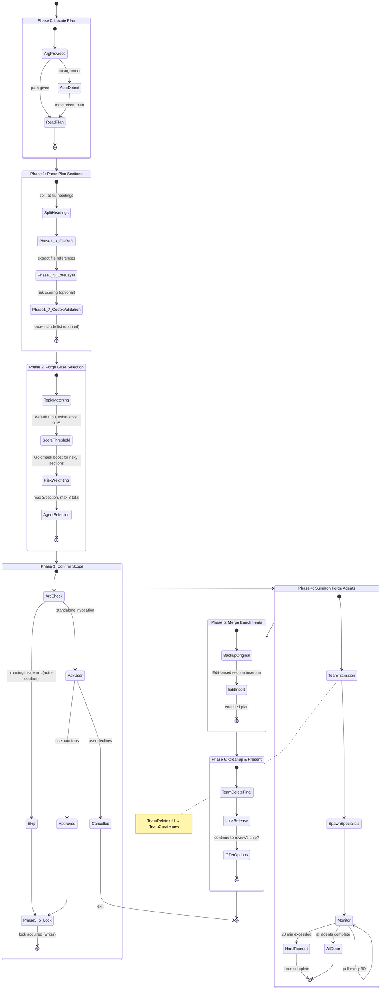

---

## 9. Goldmask

**Command**: `/rune:goldmask`
**Duration**: 5–10 min | **Agents**: 8 (5 tracers + analyst + sage + coordinator)

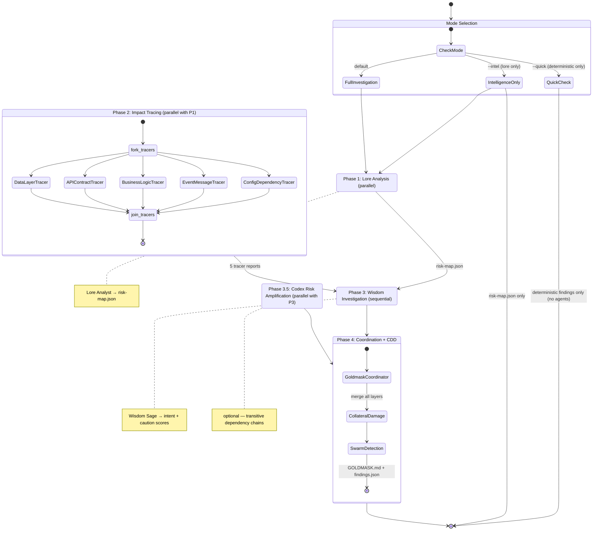

### Goldmask Output Structure

```
tmp/goldmask/{session_id}/
├── data-layer.md          ← Phase 2: DataLayerTracer
├── api-contract.md        ← Phase 2: APIContractTracer
├── business-logic.md      ← Phase 2: BusinessLogicTracer
├── event-message.md       ← Phase 2: EventMessageTracer
├── config-dependency.md   ← Phase 2: ConfigDependencyTracer
├── risk-map.json          ← Phase 1: LoreAnalyst
├── wisdom-report.md       ← Phase 3: WisdomSage
├── risk-amplification.md  ← Phase 3.5: Codex (optional)
├── GOLDMASK.md            ← Phase 4: Coordinator (final report)
└── findings.json          ← Phase 4: machine-readable findings
```

---

## 10. Inspect

**Command**: `/rune:inspect plans/... [--fix]`
**Duration**: 5–15 min | **Inspectors**: 4 parallel

```mermaid
stateDiagram-v2
    [*] --> Phase0_Preflight

    state "Phase 0: Pre-flight" as Phase0_Preflight {
        [*] --> Phase0_1_ParseInput
        Phase0_1_ParseInput --> Phase0_2_ReadTalisman
        Phase0_2_ReadTalisman --> Phase0_3_GenIdentifier
        Phase0_3_GenIdentifier --> [*]
    }

    Phase0_Preflight --> Phase0_5_Classification

    state "Phase 0.5: Classification" as Phase0_5_Classification {
        [*] --> ExtractRequirements
        ExtractRequirements --> AssignPriority
        AssignPriority --> FocusScope
        FocusScope --> LimitInspectors
        LimitInspectors --> [*]
    }

    Phase0_5_Classification --> Phase1_Scope

    state "Phase 1: Scope" as Phase1_Scope {
        [*] --> IdentifyFiles
        IdentifyFiles --> DryRunGate
        DryRunGate --> [*] : --dry-run (exit early)
        DryRunGate --> Phase1_3_LoreLayer : continue
        Phase1_3_LoreLayer --> [*] : risk intelligence (optional)
    }

    Phase1_Scope --> Phase1_5_CodexDrift

    state "Phase 1.5: Codex Drift Detection" as Phase1_5_CodexDrift
    note right of Phase1_5_CodexDrift : optional cross-model drift check
    Phase1_5_CodexDrift --> Phase2_ForgeTeam

    state "Phase 2: Forge Team" as Phase2_ForgeTeam {
        [*] --> CreateInscription
        CreateInscription --> CreateTasks
        CreateTasks --> Phase2_3_5_Lock
        Phase2_3_5_Lock --> [*] : lock acquired (reader)
    }

    Phase2_ForgeTeam --> Phase3_SummonInspectors

    state "Phase 3: Summon Inspectors" as Phase3_SummonInspectors {
        [*] --> fork_inspectors
        fork_inspectors --> GraceWarden : Correctness + Completeness
        fork_inspectors --> RuinProphet : Security + Failure Modes
        fork_inspectors --> SightOracle : Performance + Design
        fork_inspectors --> VigilKeeper : Observability + Tests + Maintainability
        GraceWarden --> join_inspectors
        RuinProphet --> join_inspectors
        SightOracle --> join_inspectors
        VigilKeeper --> join_inspectors
        join_inspectors --> Phase3_1_RiskContext : inject Goldmask (optional)
        Phase3_1_RiskContext --> [*]
    }

    Phase3_SummonInspectors --> Phase4_Monitor

    state "Phase 4: Monitor" as Phase4_Monitor
    Phase4_Monitor --> Phase5_6_VerdictSynthesis

    state "Phase 5+6: Verdict Synthesis" as Phase5_6_VerdictSynthesis {
        [*] --> Phase5_2_VerdictBinder
        Phase5_2_VerdictBinder --> Phase5_3_Wait : aggregate scores
        Phase5_3_Wait --> Phase6_1_EvidenceVerify
        Phase6_1_EvidenceVerify --> Phase6_2_DisplayVerdict
        Phase6_2_DisplayVerdict --> [*] : VERDICT.md with 10 dimension scores
    }

    Phase5_6_VerdictSynthesis --> Phase7_Cleanup

    state "Phase 7: Cleanup" as Phase7_Cleanup {
        [*] --> ShutdownInspectors
        ShutdownInspectors --> TeamDeleteFinal
        TeamDeleteFinal --> FixGate
        FixGate --> Phase7_5_GapFixer : --fix flag
        FixGate --> [*] : no fix
    }

    state "Phase 7.5: Gap-Fixer Remediation" as Phase7_5_GapFixer
    Phase7_5_GapFixer --> [*] : gaps auto-fixed

    Phase7_Cleanup --> [*] : VERDICT.md delivered
```

### Inspect 9 Dimensions

| Dimension | Inspector | Weight |
|-----------|-----------|--------|
| Correctness | Grace-warden | High |
| Completeness | Grace-warden | High |
| Security | Ruin-prophet | High |
| Failure Modes | Ruin-prophet | Medium |
| Performance | Sight-oracle | Medium |
| Design | Sight-oracle | Medium |
| Observability | Vigil-keeper | Low |
| Test Coverage | Vigil-keeper | Medium |
| Maintainability | Vigil-keeper | Low |

---

## Cross-Workflow Dependencies

The arc pipeline orchestrates multiple workflows as sub-states. This diagram
shows how workflows nest inside arc:

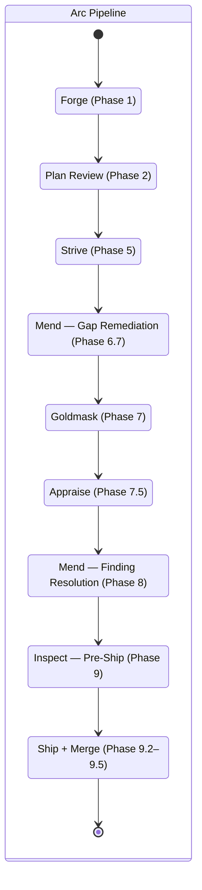

### Workflow Invocation Matrix

| Caller | Invokes | Phase | Purpose |
|--------|---------|-------|---------|
| Arc | Forge | 1 | Enrich plan |
| Arc | Strive | 5 | Implement plan |
| Arc | Mend | 6.7, 8 | Fix gaps / findings |
| Arc | Goldmask | 7 | Assess risk |
| Arc | Appraise | 7.5 | Review code |
| Arc | Inspect | 9 | Pre-ship validation |
| Appraise | Mend | auto-mend | Fix P1/P2 findings |
| Devise | Forge | Phase 3 | Enrich plan |
| Devise | Goldmask | Phase 2.3 | Predictive risk |

---

## Error Handling Tiers

All Rune workflows classify errors into 4 tiers that determine state transitions:

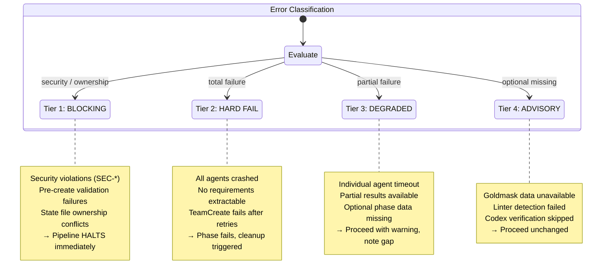

### Per-Tier Recovery Actions

| Tier | Action | Cleanup? | Resume? |
|------|--------|----------|---------|
| BLOCKING | Halt pipeline, emit error | Yes (full cleanup) | No (must fix root cause) |
| HARD FAIL | Fail current phase | Yes (full cleanup) | Arc: yes (`--resume`) |
| DEGRADED | Log warning, continue with partial data | No (still running) | N/A (didn't stop) |
| ADVISORY | Log info, skip optional enrichment | No (still running) | N/A (didn't stop) |

---

## Appendix: Artifact Location Reference

| Workflow | Output Directory | Primary Artifact |
|----------|-----------------|------------------|
| Arc | `tmp/arc/{id}/` | checkpoint.json, phase-timing.json |
| Devise | `plans/`, `tmp/plans/{ts}/` | `YYYY-MM-DD-{type}-{name}-plan.md` |
| Appraise | `tmp/reviews/{id}/` | `TOME.md` |
| Audit | `tmp/audit/{id}/` | `TOME.md`, `state.json` (incremental) |
| Strive | `tmp/work/{id}/` | worker-logs, `_summary.md` |
| Mend | `tmp/mend/{id}/` | `resolution-report.md` |
| Forge | (modifies plan in-place) | enriched plan + backup |
| Goldmask | `tmp/goldmask/{id}/` | `GOLDMASK.md`, `findings.json`, `risk-map.json` |
| Inspect | `tmp/inspect/{id}/` | `VERDICT.md` |
