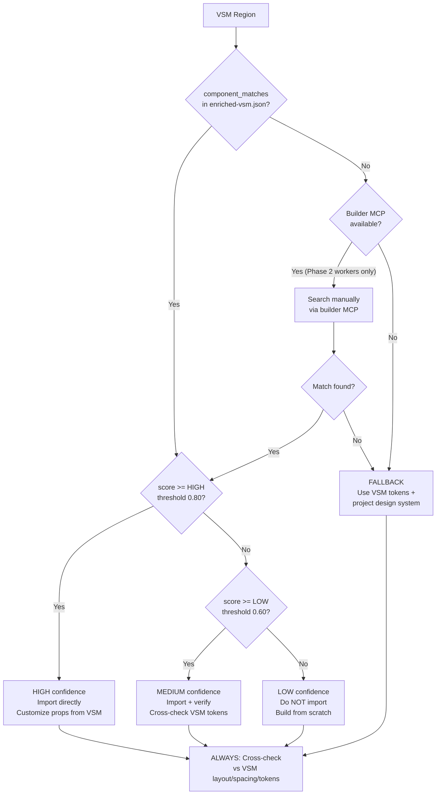

# Worker Trust Hierarchy for Design Implementation

## Source Trust Order (MANDATORY)

When implementing from design specs, follow this priority strictly.
Higher-trust sources override lower-trust sources on conflicts.

| Priority | Source | Trust Level | Use For |
|----------|--------|-------------|---------|
| 1 | VSM (Visual Spec Map) | HIGHEST | Layout structure, region hierarchy, spacing, responsive breakpoints |
| 2 | Real library components (from UI builder MCP search) | HIGH | Component implementation, props, variants |
| 3 | Design tokens (from design-system-profile) | HIGH | Colors, typography, spacing values |
| 4 | Project codebase patterns (existing code) | HIGH | Import paths, file structure, naming conventions |
| 5 | figma_to_react() reference code | LOW (~50-60%) | Visual INTENT only — what type of component, what layout direction |
| 6 | Manual Tailwind approximation | LOWEST | Last resort when no library match exists |

## figma_to_react() Reference Code Rules

The output of `figma_to_react()` is a ~50-60% accurate approximation.

**DO**:
- Extract visual INTENT: "this is a sidebar with vertical nav items"
- Identify component TYPE: card, table, form, modal, sidebar, header
- Understand layout DIRECTION: horizontal, vertical, grid, stack
- Note approximate SPACING relationships between elements

**DO NOT**:
- Copy-paste class names or Tailwind utilities from reference code
- Use the JSX structure as implementation structure
- Trust color values, font sizes, or spacing values from reference code
- Treat reference code as a starting point to "fix up"

## Per-Region Confidence Handling

When enriched-vsm.json provides `match_score` per region:

| Score Range | Confidence | Worker Action |
|-------------|-----------|---------------|
| >= 0.80 | HIGH | Import library component directly, customize props from VSM |
| 0.60-0.79 | MEDIUM | Import component, but verify visual match against VSM tokens |
| < 0.60 | LOW | Do NOT import — implement from scratch using VSM tokens + project patterns |
| No match | FALLBACK | Build from Tailwind + project design system, guided by VSM (not reference code) |

**Threshold sources**: Both boundaries are configurable via talisman.yml:
- LOW boundary (default 0.60): `design_sync.trust_hierarchy.low_confidence_threshold`
- HIGH boundary (default 0.80): `design_sync.trust_hierarchy.high_confidence_threshold`

## Decision Flowchart

### Steps (prose reference)

For each VSM region:
1. Check enriched-vsm.json for component_matches
2. IF match with score >= `high_confidence_threshold` (default 0.80) → **HIGH confidence**:
   - Import library component directly, customize props from VSM
   - Minimal verification needed
3. ELSE IF match with score >= `low_confidence_threshold` (default 0.60) → **MEDIUM confidence**:
   - Import component, but verify visual match against VSM tokens
   - Cross-check layout/spacing before committing
4. ELSE IF match with score < `low_confidence_threshold` → **LOW confidence**:
   - Do NOT import — implement from scratch using VSM tokens + project patterns
5. ELSE IF no match but builder MCP available (Phase 2 implementation workers only — extraction agents do not have direct builder MCP access):
   - Search manually with region description via builder MCP
   - If found: score against thresholds above, then follow matching branch
6. ELSE → **FALLBACK**:
   - Read VSM tokens (colors, spacing, typography)
   - Implement with project design system patterns
   - Reference code is INTENT hint only, not implementation base
7. ALWAYS: Cross-check result against VSM layout/spacing/token specs
