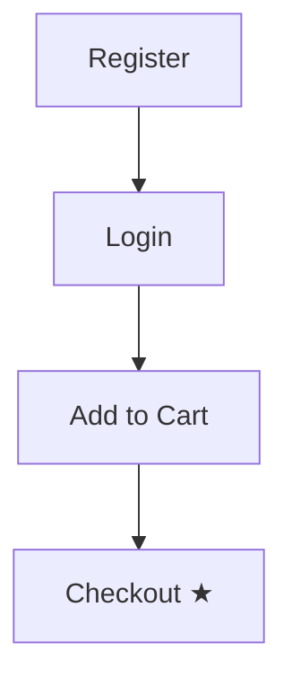

# Test Plan Generation — Context, Dependencies, Test Cases

## Purpose

Before any browser interaction, generate a structured test plan that understands
**what the feature does** and **what flows to test**. The plan is derived from
LLM reasoning over PR description, plan files, and code changes — not from
mechanical code analysis.

The test plan runs as Step 2.5 — after Route Discovery (needs routes) and before
the per-route test loop (needs execution order).

Output: `tmp/test-browser-{timestamp}/test-plan.md`

## Step 2.5: Generate Test Plan

```
generateTestPlan(scope, planFilePath, infrastructure, routes, timestamp) → TestPlan

  // ═══════════════════════════════════════════
  // 1. Gather Context
  // ═══════════════════════════════════════════

  context = {
    pr_description: "",
    plan_summary: "",
    changed_files: scope.files,
    routes: routes,
    infrastructure: infrastructure,
    acceptance_criteria: []
  }

  // Get PR description if available
  if scope.source == "pr":
    prNumber = scope.label.replace("PR #", "")
    prBody = Bash(`gh pr view ${prNumber} --json body,title --jq '"\(.title)\n\n\(.body)"' 2>/dev/null`).trim()
    context.pr_description = prBody

  // Read plan file for context
  if planFilePath:
    planContent = Read(planFilePath)
    context.plan_summary = planContent
    // Extract acceptance criteria if present (for validation against test results later)
    context.acceptance_criteria = extractYamlCriteria(planContent)

  // ═══════════════════════════════════════════
  // 2. Analyze & Reason About Flows (LLM phase)
  // ═══════════════════════════════════════════

  // This is where the LLM reasons about WHAT to test based on context.
  // NOT mechanical code analysis — understanding the feature intent.
  //
  // Key reasoning steps:
  // a) What is this feature doing? (from PR desc + plan + code changes)
  // b) What user flows does it affect? (login, registration, CRUD, etc.)
  // c) What prerequisite flows are needed? (need account? need data? need permissions?)
  // d) What order must they execute in? (dependency chain)
  // e) What could go wrong? (edge cases, error states, boundary conditions)
  // f) What would a real user expect to see? (expected results)

  // ═══════════════════════════════════════════
  // 3. Build Dependency Chain
  // ═══════════════════════════════════════════

  // Dependency chain is a DAG (directed acyclic graph).
  // Each node is a user flow (register, login, create item, etc.).
  // Edges represent "must complete before".

  // Example for "test checkout page":
  //   Register → Login → Browse Products → Add to Cart → Checkout

  dependencyChain = buildDependencyChain(context)
  // Returns: [
  //   { id: "DEP-001", flow: "Register", route: "/register", depends_on: [] },
  //   { id: "DEP-002", flow: "Login", route: "/login", depends_on: ["DEP-001"] },
  //   { id: "DEP-003", flow: "Add to Cart", route: "/products", depends_on: ["DEP-002"] },
  // ]

  // Resolve execution order via topological sort
  executionOrder = topologicalSort(dependencyChain)

  // Cycle detection (critical — prevents infinite loops)
  if executionOrder.length < dependencyChain.length:
    cycleNodes = dependencyChain.filter(d => !executionOrder.includes(d.id))
    log WARN: "Cycle detected involving: ${cycleNodes.map(n => n.flow).join(' → ')}"
    // Break cycle: add cycle nodes at the end, ordered by fewest dependencies
    executionOrder.push(
      ...cycleNodes
        .sort((a,b) => a.depends_on.length - b.depends_on.length)
        .map(n => n.id)
    )

  // Cap dependency chain depth to avoid fragile long chains
  if executionOrder.length > 8:
    log WARN: "Large dependency chain (${executionOrder.length} flows) — consider simplifying"

  // ═══════════════════════════════════════════
  // 4. Generate Test Cases
  // ═══════════════════════════════════════════

  testCases = []

  // Dependency flows become prerequisite test cases
  for each dep in executionOrder:
    node = dependencyChain.find(d => d.id == dep)
    if isPrerequisite(node, routes):
      testCases.push({
        id: `TC-${padded(testCases.length + 1)}`,
        type: "prerequisite",
        scenario: node.flow,
        route: node.route,
        steps: generateFlowSteps(node, infrastructure),
        expected: describeExpectedResult(node),
        edge_cases: [],  // Prerequisites: focus on happy path
        depends_on: node.depends_on.map(d => testCaseIdFor(d))
      })

  // Target feature routes become primary test cases
  for each route in routes:
    prereqs = findPrerequisiteTestCases(route, dependencyChain, testCases)
    testCases.push({
      id: `TC-${padded(testCases.length + 1)}`,
      type: "primary",
      scenario: describeRouteScenario(route, context),
      route: route,
      steps: generateFlowSteps(route, context, infrastructure),
      expected: describeExpectedResult(route, context),
      edge_cases: identifyEdgeCases(route, context),
      depends_on: prereqs.map(p => p.id)
    })

  // ═══════════════════════════════════════════
  // 5. Write Test Plan
  // ═══════════════════════════════════════════

  plan = formatTestPlan(context, dependencyChain, executionOrder, testCases, infrastructure)

  planPath = `tmp/test-browser-${timestamp}/test-plan.md`
  Write(planPath, plan)

  return { testCases, executionOrder, dependencyChain, planPath }
```

## Topological Sort — Kahn's Algorithm

Uses BFS-based topological sort which naturally detects cycles: if the sorted
output has fewer nodes than input, a cycle exists.

```
topologicalSort(dependencyChain) → string[]

  // Build adjacency and in-degree maps
  inDegree = {}
  adjacency = {}

  for each node in dependencyChain:
    inDegree[node.id] = node.depends_on.length
    adjacency[node.id] = adjacency[node.id] ?? []

    for each depId in node.depends_on:
      adjacency[depId] = adjacency[depId] ?? []
      adjacency[depId].push(node.id)

  // Initialize queue with zero in-degree nodes
  queue = dependencyChain
    .filter(n => inDegree[n.id] == 0)
    .map(n => n.id)

  sorted = []

  while queue.length > 0:
    current = queue.shift()
    sorted.push(current)

    for each neighbor in (adjacency[current] ?? []):
      inDegree[neighbor] -= 1
      if inDegree[neighbor] == 0:
        queue.push(neighbor)

  // If sorted.length < dependencyChain.length, a cycle exists
  return sorted
```

## Dependency Chain Builder

The LLM reasons about what flows are needed and their ordering.

```
buildDependencyChain(context) → DependencyNode[]

  chain = []
  depCounter = 1

  // Analyze context to identify required prerequisite flows.
  // This is LLM reasoning — the algorithm provides structure, but
  // the actual flow identification comes from understanding the feature.

  // Common prerequisite patterns:
  //
  // Auth-gated routes:
  //   If route requires authentication → add Register + Login deps
  //   Detect: route behind /dashboard, /settings, /admin, or plan mentions "authenticated"
  //
  // Data-dependent routes:
  //   If route displays data → add data creation dep
  //   Detect: route is /items/:id, /orders/:id, or plan mentions CRUD
  //
  // Permission-gated routes:
  //   If route requires specific role → add role setup dep
  //   Detect: route under /admin, or plan mentions "admin", "role", "permission"
  //
  // Multi-step flows:
  //   If feature is multi-step → each step is a dep of the next
  //   Detect: plan mentions "wizard", "checkout", "onboarding"

  // Step 1: Identify prerequisite flows from context
  prereqFlows = identifyPrerequisiteFlows(context)
  // Returns: [
  //   { flow: "Register", route: "/register", reason: "auth-gated" },
  //   { flow: "Login", route: "/login", reason: "auth-gated" },
  // ]

  // Step 2: Build chain with dependencies
  for each prereq in prereqFlows:
    // Find what this prereq depends on (e.g., Login depends on Register)
    depIds = chain
      .filter(c => prereq.depends_on_flows?.includes(c.flow))
      .map(c => c.id)

    node = {
      id: `DEP-${padded(depCounter)}`,
      flow: prereq.flow,
      route: prereq.route,
      depends_on: depIds,
      reason: prereq.reason
    }
    chain.push(node)
    depCounter++

  return chain
```

## Acceptance Criteria Extraction

When a plan file contains YAML acceptance criteria, extract them for later
validation against test results.

```
extractYamlCriteria(planContent) → AcceptanceCriteria[]

  criteria = []

  // Look for YAML criteria blocks in plan content
  // Format: AC-NNN blocks with description, validation, and priority
  //
  // Example in plan:
  //   acceptance_criteria:
  //     - id: AC-001
  //       description: User can register with email/password
  //       validation: Registration form submits successfully
  //       priority: must-have
  //     - id: AC-002
  //       description: User sees dashboard after login
  //       validation: Dashboard page renders with user data
  //       priority: must-have

  // Extract YAML blocks between --- markers or from acceptance_criteria key
  yamlBlocks = planContent.match(/acceptance_criteria:\n([\s\S]*?)(?=\n[^\s]|\n---|\Z)/g)

  if yamlBlocks:
    for each block in yamlBlocks:
      parsed = parseYaml(block)
      if parsed.acceptance_criteria:
        criteria.push(...parsed.acceptance_criteria)

  return criteria
```

## Test Case Helpers

### Flow Step Generation

```
generateFlowSteps(target, context, infrastructure) → string[]

  steps = []

  // Navigate to route
  steps.push(`Navigate to ${target.route}`)

  // If auth-gated and credentials available
  if infrastructure.credentials and requiresAuth(target):
    steps.push(`Ensure authenticated (use ${infrastructure.credentials.source} credentials)`)

  // Generate interaction steps based on route type and feature context
  //
  // Form routes (/register, /login, /settings):
  //   → Fill each input field with appropriate test data
  //   → Click submit button
  //   → Wait for response / redirect
  //
  // List/table routes (/items, /users, /orders):
  //   → Verify data renders in table/list
  //   → Check pagination if present
  //   → Verify sort/filter controls
  //
  // Detail routes (/items/:id, /users/:id):
  //   → Verify all data fields populated
  //   → Check edit/delete actions available
  //
  // The actual steps are LLM-generated based on understanding
  // the feature from PR description and plan context.

  steps.push(`Wait for page content to load`)
  steps.push(`Capture screenshot`)

  return steps
```

### Edge Case Identification

```
identifyEdgeCases(route, context) → string[]

  edgeCases = []

  // Common edge cases by route type:
  //
  // Form submissions:
  //   - Empty/missing required fields
  //   - Invalid email format
  //   - Password too short/weak
  //   - Duplicate submission (double-click)
  //   - Special characters in text fields
  //
  // Data display:
  //   - Empty state (no data yet)
  //   - Large datasets (pagination boundary)
  //   - Missing/null fields
  //   - Long text content (overflow)
  //
  // Navigation:
  //   - Direct URL access (deep linking)
  //   - Back button behavior
  //   - Unauthorized access attempt
  //
  // Network:
  //   - Slow response (loading state visible?)
  //   - Error response (error message displayed?)

  // The LLM selects relevant edge cases based on the specific feature.
  // Not all categories apply to every route.

  return edgeCases
```

### Prerequisite Detection

```
isPrerequisite(node, targetRoutes) → boolean

  // A node is a prerequisite if its route is NOT in the target routes.
  // Target routes are the ones we actually want to test.
  // Prerequisites are flows we need to complete BEFORE testing targets.

  return !targetRoutes.includes(node.route)


findPrerequisiteTestCases(route, dependencyChain, existingTestCases) → TestCase[]

  // Find which dependency nodes lead to this route
  routeNode = dependencyChain.find(d => d.route == route)
  if !routeNode: return []

  // Walk the dependency chain backwards
  prereqIds = collectTransitiveDependencies(routeNode.id, dependencyChain)

  // Map dependency IDs to already-created test cases
  return existingTestCases.filter(tc =>
    prereqIds.includes(dependencyIdForTestCase(tc))
  )


collectTransitiveDependencies(nodeId, chain) → string[]

  // BFS to collect all transitive dependencies
  visited = new Set()
  queue = [nodeId]

  while queue.length > 0:
    current = queue.shift()
    node = chain.find(d => d.id == current)
    if !node: continue

    for each depId in node.depends_on:
      if !visited.has(depId):
        visited.add(depId)
        queue.push(depId)

  return Array.from(visited)
```

## Test Plan Output Format

Written to `tmp/test-browser-{timestamp}/test-plan.md`:

```markdown
# Test Plan — {Feature/PR Description}

**Source**: {PR #N / plan file / current branch}
**Generated**: {ISO timestamp}
**Base URL**: {base_url} (source: {infrastructure source})
**Credentials**: {found / not found — will create via UI}

## Context

{What changed — from PR/plan/diff}
{What this feature does — LLM reasoning}
{What matters to test — key user flows}

## Infrastructure

| Component | Status | Details |
|-----------|--------|---------|
| Docker Compose | {yes/no} | {services list} |
| Tunnel | {type/none} | {config file} |
| Proxy | {type/none} | {config file} |
| Credentials | {found/create} | {source} |

## Dependency Chain



**Execution order**: DEP-001 → DEP-002 → DEP-003 → TC-004

## Test Cases

### TC-001: Register New User (prerequisite)
- **Route**: /register
- **Depends on**: none
- **Steps**:
  1. Navigate to /register
  2. Fill email field with {credentials.email or generated}
  3. Fill password field with {credentials.password or generated}
  4. Click "Register" / "Sign Up" button
  5. Wait for redirect / success message
- **Expected**: Account created, redirected to dashboard/home
- **Screenshot**: Before registration form, after success

### TC-002: Login (prerequisite)
- **Route**: /login
- **Depends on**: TC-001
- **Steps**:
  1. Navigate to /login
  2. Fill email with registered email
  3. Fill password
  4. Click "Login" / "Sign In"
  5. Wait for redirect
- **Expected**: Session established, user menu visible
- **Screenshot**: Login form, after login

### TC-003: {Target Feature} (primary)
- **Route**: /feature-route
- **Depends on**: TC-002
- **Steps**: {LLM-generated steps based on feature understanding}
- **Expected**: {What a real user would expect to see}
- **Edge cases**:
  - {empty input}
  - {invalid data}
  - {boundary conditions}
- **Screenshot**: Before action, after action, edge case states

## Post-Test Checklist

- [ ] TC-001: Register — {PENDING}
- [ ] TC-002: Login — {PENDING}
- [ ] TC-003: Feature — {PENDING}
- [ ] All screenshots captured
- [ ] No unexpected console errors
- [ ] All edge cases verified
```

## Test Plan Formatter

```
formatTestPlan(context, dependencyChain, executionOrder, testCases, infrastructure) → string

  lines = []

  // Header
  featureDesc = context.pr_description
    ? context.pr_description.split("\n")[0]  // first line = title
    : "Current Branch Changes"

  lines.push(`# Test Plan — ${featureDesc}`)
  lines.push(``)
  lines.push(`**Source**: ${context.pr_description ? "PR" : (context.plan_summary ? "Plan file" : "Current branch")}`)
  lines.push(`**Generated**: ${new Date().toISOString()}`)
  lines.push(`**Base URL**: ${infrastructure.base_url} (source: ${infrastructure.source})`)
  lines.push(`**Credentials**: ${infrastructure.credentials ? "found" : "not found — will create via UI"}`)
  lines.push(``)

  // Context section
  lines.push(`## Context`)
  lines.push(``)
  if context.pr_description:
    lines.push(context.pr_description)
  if context.plan_summary:
    lines.push(`### Plan Summary`)
    // Truncate to first 500 chars to keep plan concise
    lines.push(context.plan_summary.substring(0, 500))
  lines.push(``)

  // Infrastructure table
  lines.push(`## Infrastructure`)
  lines.push(``)
  lines.push(`| Component | Status | Details |`)
  lines.push(`|-----------|--------|---------|`)
  lines.push(`| Docker Compose | ${infrastructure.docker ? "yes" : "no"} | ${infrastructure.docker_services ?? "—"} |`)
  lines.push(`| Tunnel | ${infrastructure.tunnel_type ?? "none"} | ${infrastructure.tunnel_config ?? "—"} |`)
  lines.push(`| Proxy | ${infrastructure.proxy_type ?? "none"} | ${infrastructure.proxy_config ?? "—"} |`)
  lines.push(`| Credentials | ${infrastructure.credentials ? "found" : "create"} | ${infrastructure.credentials?.source ?? "—"} |`)
  lines.push(``)

  // Dependency chain — mermaid diagram
  if dependencyChain.length > 0:
    lines.push(`## Dependency Chain`)
    lines.push(``)
    lines.push("```mermaid")
    lines.push(`graph TD`)
    for each node in dependencyChain:
      // Primary test targets get a ★ marker
      isPrimary = context.routes.includes(node.route)
      label = isPrimary ? `${node.flow} ★` : node.flow
      for each depId in node.depends_on:
        lines.push(`  ${depId}[${dependencyChain.find(d => d.id == depId).flow}] --> ${node.id}[${label}]`)
      if node.depends_on.length == 0:
        lines.push(`  ${node.id}[${label}]`)
    lines.push("```")
    lines.push(``)
    lines.push(`**Execution order**: ${executionOrder.join(" → ")}`)
    lines.push(``)

  // Test cases
  lines.push(`## Test Cases`)
  lines.push(``)

  for each tc in testCases:
    lines.push(`### ${tc.id}: ${tc.scenario} (${tc.type})`)
    lines.push(`- **Route**: ${tc.route}`)
    lines.push(`- **Depends on**: ${tc.depends_on.length > 0 ? tc.depends_on.join(", ") : "none"}`)
    lines.push(`- **Steps**:`)
    for each [i, step] in tc.steps.entries():
      lines.push(`  ${i + 1}. ${step}`)
    lines.push(`- **Expected**: ${tc.expected}`)
    if tc.edge_cases.length > 0:
      lines.push(`- **Edge cases**:`)
      for each ec in tc.edge_cases:
        lines.push(`  - ${ec}`)
    lines.push(`- **Screenshot**: Before action, after action`)
    lines.push(``)

  // Post-test checklist
  lines.push(`## Post-Test Checklist`)
  lines.push(``)
  for each tc in testCases:
    lines.push(`- [ ] ${tc.id}: ${tc.scenario} — {PENDING}`)
  lines.push(`- [ ] All screenshots captured`)
  lines.push(`- [ ] No unexpected console errors`)
  if testCases.some(tc => tc.edge_cases.length > 0):
    lines.push(`- [ ] All edge cases verified`)

  return lines.join("\n")
```

## ID Helpers

```
padded(n) → string
  return String(n).padStart(3, "0")

testCaseIdFor(depId) → string
  // Map a dependency ID (DEP-001) to its corresponding test case ID (TC-001)
  // by looking up the test case that covers that dependency flow
  return existingTestCases.find(tc => tc.depId == depId)?.id ?? depId

dependencyIdForTestCase(tc) → string
  // Reverse map: test case → dependency chain node ID
  return tc.depId ?? tc.id
```
